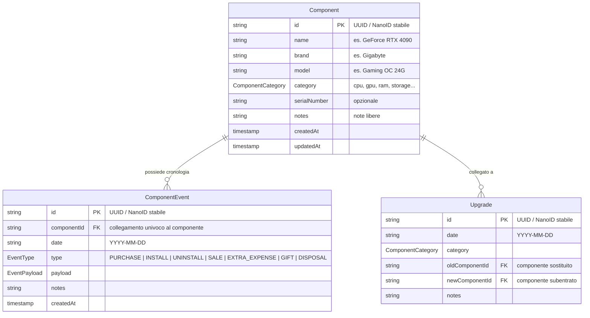

# Modello Dati e Logica di Dominio — PC Hardware & Upgrade Tracker

## 1. Principio Fondamentale del Modello Dati

L'applicazione **non** memorizza liste statiche o frammentate di componenti ("attuali", "vecchi", "venduti"). 
Al contrario, adotta un modello ispirato all'**Event Sourcing**:

> **Un componente possiede un'identità immutabile e stabile (ID univoco) e una sequenza ordinata nel tempo di eventi.**

Tutti gli stati (attuale o a qualsiasi data passata), i costi netti, i periodi di permanenza nel case e le statistiche storiche vengono calcolati come **proiezioni deterministiche (funzioni pure)** a partire dalla cronologia degli eventi.

---

## 2. Diagramma Entità-Relazione (ERD)



---

## 3. Specifiche di Tipo (TypeScript)

### 3.1 Categorie dei Componenti
```typescript
export type ComponentCategory =
  | 'cpu'
  | 'gpu'
  | 'motherboard'
  | 'ram'
  | 'storage'
  | 'psu'
  | 'case'
  | 'cooling'
  | 'monitor'
  | 'peripherals'
  | 'accessories'
  | 'other';
```

Le categorie hanno etichette predefinite in italiano, ma sono configurabili ed estensibili.

---

### 3.2 Tipi di Eventi del Componente (`EventType`)

Ogni evento rappresenta una mutazione concreta nella vita del componente:

| Tipo Evento | Significato Concreto | Campi Specifici del Payload |
| :--- | :--- | :--- |
| `PURCHASE` | Acquisto iniziale del componente | `price` (EUR), `store`, `orderNumber`, `link`, `condition` ('new' \| 'used'), `warrantyExpiryDate` |
| `INSTALL` | Montaggio fisico nel case | `slotOrLocation` (es. "PCIe 1", "M.2 Slot 1"), `notes` |
| `UNINSTALL` | Smontaggio dal case (spostamento in magazzino) | `reason` ('upgrade' \| 'maintenance' \| 'storage' \| 'defect'), `notes` |
| `SALE` | Vendita del componente dismesso | `price` (EUR lordo incassato), `platform` (es. "Subito", "eBay"), `buyer`, `shippingCost`, `fees` |
| `EXTRA_EXPENSE` | Spesa accessoria sostenuta per quel componente | `amount` (EUR), `description` (es. "Pasta termica / Pad", "Waterblock", "Cavo 12VHPWR dedicato") |
| `GIFT` | Componente ceduto gratuitamente (regalato) | `recipient` (es. "Fratello", "Amico"), `notes` |
| `DISPOSAL` | Componente smaltito o dismesso senza ricavo | `disposalMethod` ('recycled' \| 'broken_discarded' \| 'eco_center'), `notes` |

---

### 3.3 Contratti TypeScript Completi degli Eventi

```typescript
export interface BaseEvent {
  id: string; // Identificativo stabile (UUID)
  componentId: string; // Riferimento univoco al componente
  date: string; // ISO formato YYYY-MM-DD
  createdAt: string; // ISO 8601 timestamp
  notes?: string;
}

export interface PurchaseEvent extends BaseEvent {
  type: 'PURCHASE';
  price: number; // In Euro (es. 1650.00)
  store?: string; // es. "Amazon", "Caseking", "Privato"
  orderNumber?: string;
  link?: string;
  condition?: 'new' | 'used';
  warrantyExpiryDate?: string; // YYYY-MM-DD
}

export interface InstallEvent extends BaseEvent {
  type: 'INSTALL';
  slotOrLocation?: string;
}

export interface UninstallEvent extends BaseEvent {
  type: 'UNINSTALL';
  reason?: 'upgrade' | 'maintenance' | 'storage' | 'defect' | 'other';
}

export interface SaleEvent extends BaseEvent {
  type: 'SALE';
  price: number; // Prezzo lordo di vendita concordato
  platform?: string; // es. "Subito.it", "eBay", "Vinted", "Scambio a mano"
  buyer?: string;
  shippingCost?: number; // Costo di spedizione a carico del venditore
  fees?: number; // Commissioni di vendita trattenute dalla piattaforma
}

export interface ExtraExpenseEvent extends BaseEvent {
  type: 'EXTRA_EXPENSE';
  amount: number; // Importo spesa in Euro
  description: string;
}

export interface GiftEvent extends BaseEvent {
  type: 'GIFT';
  recipient?: string; // A chi è stato regalato il componente
}

export interface DisposalEvent extends BaseEvent {
  type: 'DISPOSAL';
  disposalMethod: 'recycled' | 'broken_discarded' | 'eco_center';
}

export type ComponentEvent =
  | PurchaseEvent
  | InstallEvent
  | UninstallEvent
  | SaleEvent
  | ExtraExpenseEvent
  | GiftEvent
  | DisposalEvent;
```

---

### 3.4 Stato Attuale Derivato di un Componente (`ComponentComputedState`)

Il motore logico calcola in tempo reale lo stato a partire dalla sequenza ordinata degli eventi:

```typescript
export type ComponentStatus = 
  | 'IN_USE'         // Attualmente installato nel PC
  | 'IN_STORAGE'      // In magazzino / nel cassetto (posseduto ma non montato)
  | 'SOLD'            // Venduto
  | 'GIFTED'          // Regalato a terzi
  | 'DISPOSED';       // Smaltito (rotto, isola ecologica, riciclato)

export interface ComponentComputedState {
  component: Component;
  status: ComponentStatus;
  
  // Metriche finanziarie individuali
  totalPurchaseCost: number;     // Somma di PURCHASE.price + EXTRA_EXPENSE.amount
  totalSaleRevenue: number;      // Prezzo SALE al netto di fees e shippingCost
  netCost: number;               // totalPurchaseCost - totalSaleRevenue
  
  // Date rilevanti
  purchaseDate?: string;
  firstInstallDate?: string;
  lastInstallDate?: string;
  lastUninstallDate?: string;
  saleDate?: string;
  giftDate?: string;
  disposalDate?: string;
  
  // Metriche temporali
  daysInUse: number;             // Somma dei giorni effettivi di montaggio
  daysOwned: number;             // Giorni trascorsi dall'acquisto ad oggi (o alla dismissione)
  costPerDayInUse: number;       // netCost / (daysInUse > 0 ? daysInUse : 1)
}
```

#### Regole di Transizione di Stato:
Per qualsiasi componente $C$, analizzando gli eventi in ordine cronologico:
1. Se l'ultimo evento del componente è `SALE` $\rightarrow$ **`SOLD`**.
2. Se l'ultimo evento è `GIFT` $\rightarrow$ **`GIFTED`**.
3. Se l'ultimo evento è `DISPOSAL` $\rightarrow$ **`DISPOSED`**.
4. Se l'ultimo evento tra montaggi e smontaggi è `INSTALL` $\rightarrow$ **`IN_USE`**.
5. Se l'ultimo evento è `UNINSTALL` oppure se è presente solo l'evento `PURCHASE` $\rightarrow$ **`IN_STORAGE`**.

---

## 3.5 Ricostruzione Storica della Configurazione (Point-in-Time PC Rig)

Il modello supporta nativamente la ricostruzione della configurazione esatta del PC in qualsiasi momento storico $T$ senza bisogno di salvare snapshot duplicati.

### Algoritmo di Ricostruzione Point-in-Time:
Data una data target $T$ (es. `2024-06-15`), una funzione pura:
`getConfigurationAtDate(components: Component[], events: ComponentEvent[], targetDate: string): Component[]`

opera come segue:
1. Per ogni componente $C$, filtra gli eventi con `date <= targetDate`, ordinati per data crescente.
2. Se non esiste un evento `PURCHASE` con data $\le T$, il componente non era ancora stato acquistato a quella data.
3. Se tra gli eventi considerati è presente un evento terminale (`SALE`, `GIFT`, `DISPOSAL`), il componente era già stato dismesso prima di $T$.
4. Si controlla l'ultimo evento rilevante tra `INSTALL` e `UNINSTALL` con data $\le T$:
   - Se l'ultimo evento è `INSTALL`, **il componente era fisicamente montato nel PC alla data $T$**.
   - Se l'ultimo evento è `UNINSTALL`, il componente era temporaneamente in magazzino.

### Esempio Pratico:
- **15/06/2024**: GPU = `RTX 4080` (installata il 10/01/2023, rimossa il 02/08/2025).
- **20/08/2025**: GPU = `RTX 4090` (acquistata e installata il 02/08/2025).
- **10/03/2026**: GPU = `RTX 5090` (installata il 01/02/2026, RTX 4090 rimossa e venduta).

Questo approccio garantisce scalabilità e consente in futuro di implementare una vista retrospettiva ("Time Machine") a costo architetturale zero.

---

## 4. Metriche Finanziarie Formalizzate

Le metriche finanziarie dell'applicazione sono definite in modo rigoroso, non ambiguo e **completamente indipendente dalla UI**:

| Metrica | Definizione e Formula | Significato Concreto |
| :--- | :--- | :--- |
| **Totale Acquistato Storico** | $\sum_{\text{eventi } PURCHASE} \text{price} + \sum_{\text{eventi } EXTRA\_EXPENSE} \text{amount}$ | La totalità del denaro speso per acquistare hardware e accessori PC nel corso degli anni. |
| **Totale Recuperato dalle Vendite** | $\sum_{\text{eventi } SALE} (\text{price} - (\text{shippingCost} \lor 0) - (\text{fees} \lor 0))$ | La totalità del denaro netto realmente incassato dalla vendita di componenti usati. |
| **Costo Netto Storico** | $\text{Totale Acquistato Storico} - \text{Totale Recuperato dalle Vendite}$ | La spesa netta effettiva sostenuta per l'hobby del PC nel corso del tempo (l'esborso reale non recuperato). |
| **Costo Configurazione Attuale** | $\sum_{C \in \text{Componenti con stato } IN\_USE} (\text{PURCHASE.price}(C) + \sum \text{EXTRA\_EXPENSE.amount}(C))$ | Il costo di acquisto storico dei soli componenti che compongono attualmente la macchina montata. |
| **Costo Netto Singolo Componente** | $\text{Costo Acquisto Totale}(C) - \text{Ricavo Netto Vendita}(C)$ | Quanto è costato possedere quello specifico pezzo (se venduto, è il deprezzamento reale). |
| **Costo Netto di un Upgrade** | $\text{Costo Acquisto Nuovo Pezzo} - \text{Ricavo Netto Vendita Pezzo Sostituito}$ | Quanto è costato il cambio generazionale (es. RTX 3080 $\rightarrow$ RTX 4090). |

> [!WARNING]
> **Nota su "Valore di Mercato Attuale"**: L'applicazione **non** calcola automaticamente un valore stimato di mercato per i componenti posseduti, poiché non esiste un feed dati pubblico e affidabile per i prezzi correnti dell'hardware usato. Tale funzionalità potrà essere considerata in futuro come campo inserito manualmente o tramite integrazione specifica, ma non fa parte dei calcoli del core attuale.

---

## 5. Gestione degli Upgrade

L'entità `Upgrade` formalizza il passaggio tecnologico tra due componenti:

```typescript
export interface Upgrade {
  id: string; // UUID stabile
  date: string; // YYYY-MM-DD
  category: ComponentCategory;
  oldComponentId?: string; // ID componente sostituito
  newComponentId: string;  // ID componente subentrato
  notes?: string;
}

export interface UpgradeComputedSummary {
  upgrade: Upgrade;
  oldComponent?: Component;
  newComponent: Component;
  newComponentCost: number;
  oldComponentRecovered: number;
  netUpgradeCost: number; // newComponentCost - oldComponentRecovered
}
```

---

## 6. Schema del Database e Persistenza su IndexedDB

Tutti i dati dell'applicazione risiedono **esclusivamente su IndexedDB** (Single Source of Truth) nel database `pc_tracker_db`, organizzati in **5 object stores dedicati**:

1. **`components`**: record di anagrafica hardware (`keyPath: 'id'`).
2. **`events`**: sequenza temporale degli eventi di ciclo di vita (`keyPath: 'id'`, indice su `componentId`, indice su `date`).
3. **`upgrades`**: collegamenti generazionali tra vecchio e nuovo pezzo (`keyPath: 'id'`, indice su `category`, indice su `date`).
4. **`checkpoints`**: fotografie storiche immutabili della configurazione (`keyPath: 'id'`, indice su `referenceDate`, indice su `relatedUpgradeId`).
5. **`metadata`**: metadati applicativi e impostazioni di configurazione utente (`keyPath: 'key'`).

```typescript
export interface DatabaseSchema {
  schemaVersion: number; // 1
  appVersion: string;    // "1.0.0"
  lastModified: string;  // ISO 8601 timestamp
  settings: AppSettings;
  components: Component[];
  events: ComponentEvent[];
  upgrades: Upgrade[];
  checkpoints: Checkpoint[];
}
```

