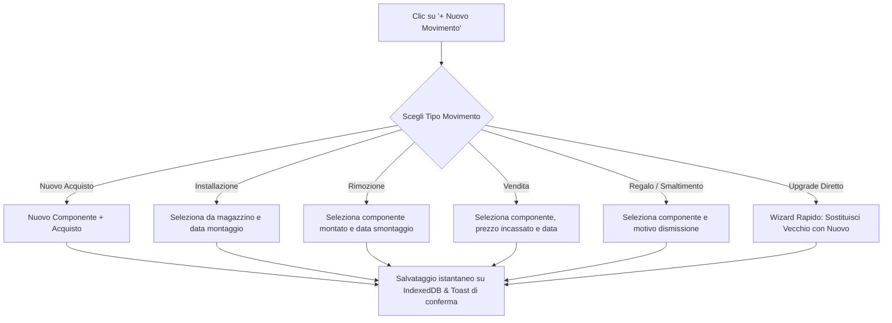

# Esperienza Utente (UX) e Design System — PC Hardware & Upgrade Tracker

## 1. Filosofia Visiva e Tono dell'Applicazione

L'app non deve ricordare né un gestionale aziendale grigio né un clone generico di template SaaS con gradienti e bagliori al neon. Adotta l'estetica **Sophisticated Dark Hardware Enthusiast** e segue i principi del **"Less, but better"**:

- **Atmosfera**: Scura, profonda, rigorosa e intenzionale. Ogni pixel e ogni bordo ha una funzione chiara.
- **Color Palette**: Toni ardesia e grafite profondi (`#080c14`, `#0f1626`, `#151f32`) con contrasti controllati e bordi a micro-trasparenza:
  - **Ciano Funzionale** (`#38bdf8`): Riservato ai pezzi attualmente montati nel PC (`IN_USE`) e ai comandi primari contestuali.
  - **Verde Smeraldo** (`#10b981`): Ricavi da vendite (`SALE`), bilancio positivo, stato database attivo.
  - **Rubino / Corallo** (`#f43f5e`): Spese, acquisti (`PURCHASE`, `EXTRA_EXPENSE`), azioni distruttive.
  - **Ambra / Oro** (`#f59e0b`): Componenti in magazzino (`IN_STORAGE`), azioni di rimozione.
  - **Viola / Indaco** (`#818cf8`): Componenti regalati o donati (`GIFTED`).
  - **Grigio Cenere / Muted** (`#64748b`): Componenti smaltiti (`DISPOSED`), testi secondari e metadati.
- **Tipografia**:
  - Headings: `Outfit` (pesi 600/700, tracking `-0.025em`).
  - Body & UI: `Inter` (pesi 400/500, altezze riga generose).
  - Cifre e Valute: `JetBrains Mono` con `font-feature-settings: 'tnum' 1, 'zero' 1` per allineamento tabulare perfetto.
- **Firma Personale**:
  - Discreta firma nel footer della sidebar: *"Made by Peppe"* con link esterno `@peppesthoughtss ↗` al profilo Instagram.

---

## 2. Mappa dell'Applicazione e Navigazione

La sidebar laterale fissa organizza i percorsi in cluster semantici:

```
┌────────────────────────────────────────────────────────────────────────┐
│ [Terminal PC TRACKER]              [Backup JSON]  [+ Nuovo Componente] │
├───────────────┬────────────────────────────────────────────────────────┤
│ PRINCIPALE    │                                                        │
│ 📊 Panoramica │                     AREA PRINCIPALE                    │
│ 🖥️ Il Mio PC  │                                                        │
│ 📦 Archivio   │                                                        │
│ 🚀 Upgrade    │                                                        │
│ 📈 Statistiche│                                                        │
│ ───────────── │                                                        │
│ SISTEMA       │                                                        │
│ 💾 Backup/Dati│                                                        │
│ ───────────── │                                                        │
│ Made by Peppe │                                                        │
│ @peppesthoughtss ↗                                                     │
└───────────────┴────────────────────────────────────────────────────────┘
```

### Sezioni Principali:

### 1. Dashboard (Panoramica Globale)
- **Top Metric Cards (Metriche Finanziarie Chiare)**:
  1. *Totale Acquistato Storico*: Somma di tutti gli acquisti e spese accessorie di sempre.
  2. *Totale Recuperato dalle Vendite*: Totale netto incassato dalla vendita di componenti dismessi.
  3. *Costo Netto Storico*: Spesa reale complessiva sostenuta (Acquistato - Recuperato).
  4. *Costo Configurazione Attuale*: Somma dei costi di acquisto dei soli pezzi attualmente montati nel PC.
  5. *Componenti Attivi*: Numero di componenti attualmente in uso (es. 10 componenti).
  6. *Upgrade Effettuati*: Numero di sostituzioni generazionali registrate.
- **Slot "Il Tuo Rig Oggi"**: Card compatte a griglia che mostrano i pezzi forti del PC (CPU, GPU, RAM, Storage, Mobo) con indicazione del tempo trascorso dal montaggio.
- **Grafico Spesa / Ricavi nel Tempo**: Barre orizzontali o grafici a colonne divisi per anno.
- **Attività Recente**: Feed degli ultimi 5 movimenti registrati.

---

### 2. "Il Mio PC" (Configurazione Attuale)
- Vista dettagliata dedicata unicamente alla macchina attualmente assemblata.
- Raggruppata per slot hardware:
  - *Processore (CPU)*
  - *Scheda Video (GPU)*
  - *Scheda Madre (Motherboard)*
  - *Memoria (RAM)*
  - *Archiviazione (SSD/HDD)*
  - *Alimentatore (PSU)*
  - *Case*
  - *Raffreddamento (Cooling)*
  - *Monitor & Periferiche*
- Ogni card componente mostra:
  - Nome e brand.
  - Data di installazione e giorni trascorsi ("In uso da 240 giorni").
  - Costo di acquisto.
  - Pulsante rapido: **"Sostituisci / Fai Upgrade"** (apre direttamente il wizard precompilato).

---

### 3. Archivio Componenti
- Catalogo completo di **tutto ciò che l'utente ha mai posseduto**.
- **Filtri rapidi per stato esplicito**:
  - *Tutti*
  - *In uso* (badge ciano)
  - *In magazzino* (badge ambra)
  - *Venduto* (badge smeraldo)
  - *Regalato* (badge indaco)
  - *Smaltito* (badge grigio)
- **Filtri per categoria**: Dropdown o chip per filtrare CPU, GPU, ecc.
- **Barra di ricerca fulminea**: Ricerca per nome componente, marca, negozio o numero ordine.
- **Ordinamenti**: Per data acquisto, prezzo di acquisto, costo netto, giorni di utilizzo.

---

### 4. Scheda Singolo Componente (Dettaglio)
- **Intestazione**:
  - Icona categoria, Brand e Nome completo.
  - Badge di stato attuale (`IN_USE`, `IN_STORAGE`, `SOLD`, `GIFTED`, `DISPOSED`).
- **Pannello Metriche Chiave**:
  - Prezzo d'acquisto.
  - Prezzo di vendita netto (se venduto).
  - **Costo netto effettivo**.
  - **Giorni totali di utilizzo**.
  - **Costo per giorno di utilizzo** (es. *€0.75/giorno*).
- **Dati di Riferimento**:
  - Negozio, Data scontrino/fattura, Numero d'ordine, Link di acquisto, Garanzia residua, Note personali.
- **Timeline Interattiva**:
  - Linea temporale verticale con icone distinte:
    - 🛒 **Acquisto** (`PURCHASE` - Data + Prezzo)
    - 🔧 **Installazione** (`INSTALL` - Data + Slot)
    - 📦 **Rimozione** (`UNINSTALL` - Data + Motivo)
    - 💰 **Vendita** (`SALE` - Data + Incasso + Piattaforma)
    - 🎁 **Regalo** (`GIFT` - Data + Destinatario)
    - ♻️ **Smaltimento** (`DISPOSAL` - Data + Metodo)
- **Pulsanti Azione**:
  - *+ Aggiungi evento*
  - *Modifica info generali*
  - *Elimina componente* (con conferma di sicurezza)

---

### 5. Storico Upgrade (Timeline Evolutiva)
- Pagina dedicata all'evoluzione dell'hardware nel tempo.
- Presenta visualmente ogni salto generazionale:
  ```
  [GeForce RTX 3080] ──────► (Upgrade: 15/03/2024) ──────► [GeForce RTX 4090]
  Acquisto vecchio: €750                                   Acquisto nuovo: €1.650
  Venduto vecchio:  €400
  ─────────────────────────────────────────────────────────────────────────────
  COSTO NETTO UPGRADE: €1.250
  ```
- Permette di comprendere a colpo d'occhio quanto è costato ogni singolo cambio generazionale.

---

### 6. Statistiche & Finanze
- **Spesa annuale**: Grafico a barre dei costi per anno solare.
- **Ripartizione per categoria**: Percentuali di spesa per GPU, CPU, Monitor...
- **Classifiche**:
  - Componenti più costosi di sempre.
  - Componenti rimasti più a lungo nel PC.
  - Miglior recupero percentuale alla vendita.

---

### 7. Centro Backup & Gestione Dati
- **Esporta Backup**: Scarica istantaneamente il file JSON datato da IndexedDB.
- **Importa Backup**: Drag-and-drop del file JSON con validazione dello schema e schermata di anteprima prima del ripristino.
- **Esporta CSV**: Tabella leggibile per Excel/Google Sheets.
- **Dati Demo**: Opzione per caricare o rimuovere dati di esempio per esplorare l'app.

---

## 3. Il Flusso "+ Nuovo Movimento" (UX a zero attrito)

Il pulsante "+ Nuovo Movimento" è sempre visibile in alto a destra:


